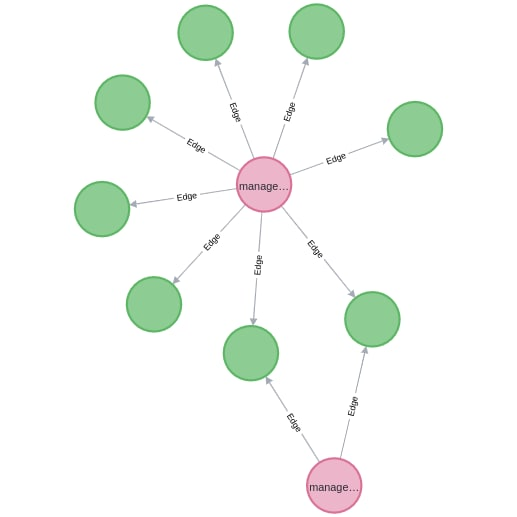

# Configs Parser

## Описание

API, позволяющий версионировать конфиги, написанный на Golang. Для хранения конфигов используется графовая база данных Neo4J. Это обусловлено тем, представление JSON в виде графа помогает сохранять большое количество места, в случае, если не нужно постоянно перезаписывать поля. 

## Выполненные технические требования
- [x] язык программирования Golang
- [x] формат схемы конфига json
- [x] сервис должен обеспечивает персистентность данных
- [x] сервис поддерживает все CRUD операции по работе с конфигом
- [x] поддерживается версионирование конфига при его изменении
- [ ] удалять конфиг допускается только если он не используется никаким приложением

## Здорово, что:
- [ ] в качестве протокола взаимодействия сервиса с клиентами использовал gRPC
- [x] написал Dockerfile и docker-compose.yml
- [ ] покрыл проект unit-тестами
- [ ] сделал тестовый пример использования написанного сервиса конфигураций

## Пример хранения данных

<div style="display:flex; justify-content:center">
  <div>
    
    <p align="center">Схема neo4j</p>
  </div>
</div>  

## Пример использования сервиса

### Запуск

Тогда можно поднимать сервис

```bash
git clone https://github.com/tenzm/configs-server
cd configs-server
docker compose up
```


### Создание конфига

#### **Запрос**

`curl -d "@data.json" -H "Content-Type: application/json" -X POST http://localhost:8080/config`

```json
{
    "service": "managed-k8s",
    "data": [
        {"key1": "value1"},
        {"key2": "value2"}
    ]
}
```

#### **Ответ**

`status_code: 200`

```json
The configuration has been saved. Current version: 1
```

### Получение конфига

`curl http://localhost:8080/config?service=managed-k8s`

```json
{
    "key1": "value1", 
    "key2": "value2"
}
```

### Изменение конфига

#### **Запрос**
`curl -d "@data.json" -H "Content-Type: application/json" -X PUT http://localhost:8080/config`

```json
{
    "service": "managed-k8s",
    "data": [
        {
            "key1": "learn"
        },
        {
            "key2": "golang"
        }
    ]
}
```

#### **Ответ**

`status_code: 200`

```json
The configuration has been updated. Current version: 2
```

### Просмотр версий конфигурации

Без указания номера версии возвращается самая последняя из версий

#### **Запрос**

`curl http://localhost:8080/config?service=managed-k8s`

#### **Ответ**

`status_code: 200`

```json
{
    "key1": "learn"
    "key2": "golang"
}
```

#### **Запрос**

`curl "http://localhost:8080/config?service=managed-k8s&version=1"`

#### **Ответ**

`status_code: 200`

```json
{
    "key1": "value1", 
    "key2": "value2"
}
```


### Удаление

#### **Запрос**

`curl -X DELETE http://localhost:8080/config/delete?service=managed-k8s`

#### **Ответ**

`status_code: 200`

```json
curl -X DELETE http://localhost:8080/config/delete?service=managed-k8s
```